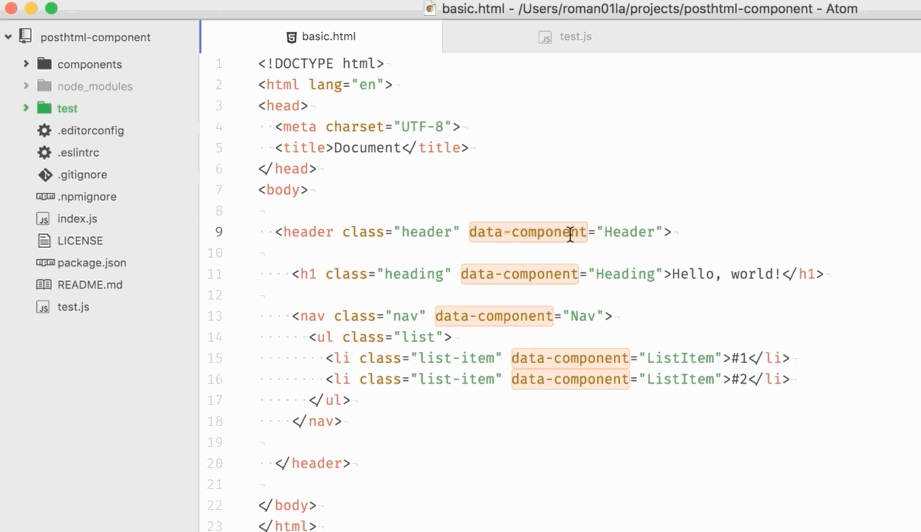

<a href="https://travis-ci.org/roman01la/html-to-react-components">
  
</a>
<a href="https://www.npmjs.com/package/html-to-react-components">
  
</a>
<a href="https://coveralls.io/github/roman01la/html-to-react-components">
  
</a>

<p>
<a href="https://www.patreon.com/bePatron?c=1239559">
  
</a>
</p>

Extract annotated portions of HTML into React components as separate modules. The structure of HTML is preserved by importing child components and replacing appropriate pieces of HTML with them. As a result you get an entire components tree ready to be rendered.

Try in [online REPL](http://roman01la.github.io/html-to-react-components/repl/)



## Contents

- [When to use it](#when-to-use-it)
- [Installation](#installation)
- [Usage](#usage)
- [CLI](#cli)
- [Options](#options)
- [Node.js API](#nodejs-api)
- [Building for browser](#building-for-browser)
- [Resources](#resources)
- [Ecosystem](#ecosystem)
- [Contributing](#contributing)
- [License](#License)

## When to use it

This utility was designed to free React developers from a boring task of translating HTML into components.

Imagine you just got a pile of HTML from your designers. The first thing you will do is break HTML into React components. This is boring and should be automated!

## Installation

```
$ npm i -g html-to-react-components
```

## Usage

HTML element with `data-component` attribute will be converted into separate React components. The value of the attribute is the name of the React component.

Additionally specify which HTML attributes should be exposed as React props using `public:` prefix.

```html
<input public:type="text" id="input" data-component="Input" />
```

```js
// at usage place
<Input type="text" />;
// ----^^^^^^^^^^^

// in component's module
class Input extends React.Component {
  render() {
    const { type } = this.props; // <----
    return <input type={type} id="input" />;
    // -----------^^^^^^^^^^^
  }
}
```

See and run `test.js` file for usage example and output.

## CLI

```
$ html2react "./src/*.html"
```

You can also use any glob pattern to recursively generate the corresponding react file. Just make sure to use double quotes when specifying the pattern:

```
$ html2react "./src/**/*.html"
```

### Options

#### componentType, --component, -c

Type of generated React components.

Values:

- `stateless`
- `es5`
- `es6` (default)

#### moduleType, --module, -m

Type of generated JavaScript modules.

Values:

- `es6` (default)
- `cjs` (CommonJS)

#### moduleFileNameDelimiter, --delimiter, -d

Delimiter character to be used in modules filename.

If you don't specify a delimiter, or pass -d without a value, then the component
name in the HTML will be used unchanged as the filename. If you do specify a
delimiter character, then the module name is broken into words, joined with the
delimiter and lower-cased.

#### output

Configuration options for output to file system.

##### path, --out, -o

Output directory path.

Default is `components` directory in the current directory.

##### fileExtension, --ext, -e

Output files extension.

Default value is `js`.

## Node.js API

```js
const extractReactComponents = require("html-to-react-components");

extractReactComponents(
  `<!DOCTYPE html>
<html lang="en">
<head>
  <meta charset="UTF-8">
  <title>Document</title>
</head>
<body>

  <header class="header" data-component="Header">

    <h1 class="heading" data-component="Heading">Hello, world!</h1>

    <nav class="nav" data-component="Nav">
      <ul class="list">
        <li class="list-item" data-component="ListItem">#1</li>
        <li class="list-item" data-component="ListItem">#2</li>
      </ul>
    </nav>

  </header>

</body>
</html>
`,
  {
    componentType: "stateless",
    moduleType: false
  }
);

/*
{ Header: 'const Header = () => <header className="header">\n\n    <Heading></Heading>\n\n    <Nav></Nav>\n\n  </header>;',
  Heading: 'const Heading = () => <h1 className="heading">Hello, world!</h1>;',
  Nav: 'const Nav = () => <nav className="nav">\n      <ul className="list">\n        <ListItem></ListItem>\n        <ListItem></ListItem>\n      </ul>\n    </nav>;',
  ListItem: 'const ListItem = () => <li className="list-item">#2</li>;' }
*/
```

## Building for browser

When building for in-browser usage an env variable `IN_BROWSER` is required to be set at compile time in order to disable Node.js-specific modules. Note that code formatting is not included in in-browser bundle.

Example of defining a var in Webpack config:

```js
  plugins: [
    new webpack.DefinePlugin({
      IN_BROWSER: JSON.stringify(true),
    }),
  ],
```

## Resources

A quick [video demo](https://www.youtube.com/embed/Cd8cNLfGcVo) on converting a simple HTML page into React components and rendering them into the same looking UI.

Annotating HTML in the editor is not the best experience, because you cannot see rendered UI itself. It's possible to annotate HTML using DevTools. Be aware that you'll have to spend time on copying and pasting markup from DevTools into files which will be processed.


## Ecosystem

- [extract-to-react](https://github.com/jesstelford/extract-to-react) is an extension for Chrome and Chromium browsers built on top of _html-to-react-components_ which allows you to extract HTML and CSS into React components and load them in CodePen or JSFiddle.

## Contributing

If you spotted a bug, please, submit a pull request with a bug fix. If you would like to add a feature or change existing behaviour, open an issue and tell about what exactly you want to change/add.

## License

MIT
